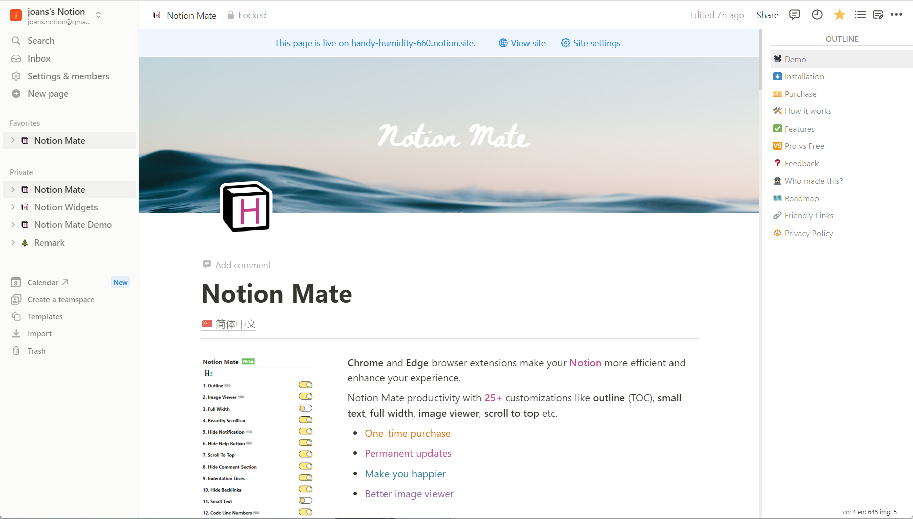

# Notion Mate

🚩An extension for notion notes that supports a more useful image viewer, icon history, side outline, and more.

| 🌐 [Notion Mate Website](https://handy-humidity-660.notion.site/Notion-Mate-f0d639e5f48d4aeabde46f1fabb66a82)

## Installation

1. 🔻[Chrome Store](https://chromewebstore.google.com/detail/notion-mate/pplckfedebdimphneohkmhlmhompgpmn)
2. 🔻[Edge store](https://chromewebstore.google.com/detail/notion-mate/pplckfedebdimphneohkmhlmhompgpmn)

⭐⭐⭐⭐⭐If you find it helpful to you, hope to get your five-star praise, thank you!

## Feedback

⚠️ Submit an [issue](https://github.com/joansnotion/NotionMate/issues) if you encounter problems during use.

## Features

- [x] 1. Outline
- [x] 2. Image Viewer
- [x] 3. Icon History
- [x] 4. Count Words
- [x] 5. Generate Header Number
- [x] 6. Prevent Table Overflow
- [x] 7. Code Line Numbers
- [x] 8. Hide Notification
- [x] 9. Hide Help Button
- [x] 10. Empty Trash
- [x] 11. Growth Height
- [x] 12. Border Image
- [x] 13. Full Width
- [x] 14. Beautify Scrollbar
- [x] 15. Scroll To Top
- [x] 16. Hide Comment Section
- [x] 17. Indentation Lines
- [x] 18. Hide Backlinks
- [x] 19. Small Text
- [x] 20. Bolder Text
- [x] 21. Narrow Row Spacing 

---

***Made .with. by @Joans · Powered .by .Notion***